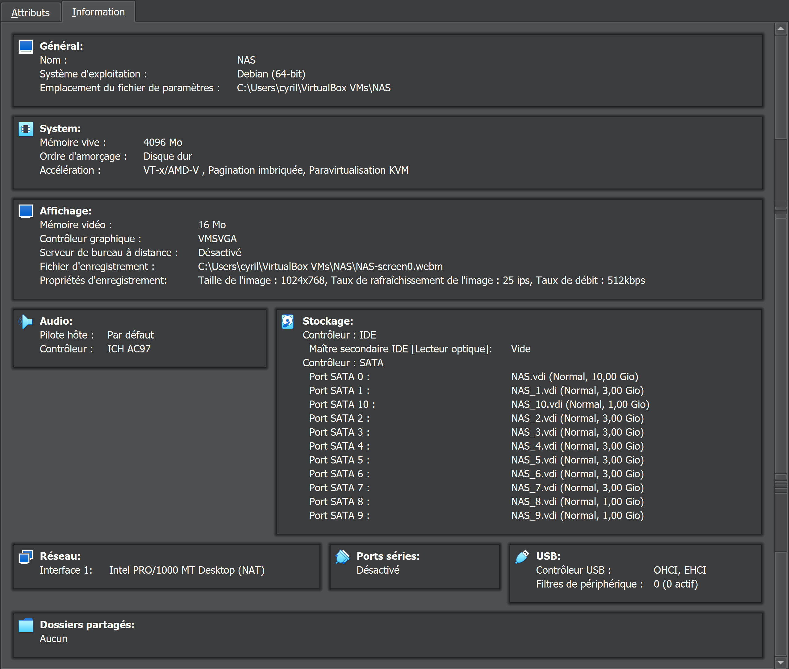

# DNS-Data-NAS-Service
Mise en place d'un serveur NAS / Backup

## Décryptage du message subliminal
**NAS is not a backup !**

Je vous rejoins complètement dans cette analyse!!!

*Je me demande du coup pourquoi je fais ce travail...*
Bon pour ce code au départ je suis parti un peu loin en pensant à un Vigenère...
Mais non juste un XOR suffisait, comme quoi l'idée la plus simple est souvent la
meilleure.

```python
from operator import xor

l=['16','0E','01','78','26','21','78','21','3D','2C','6F','33','78','2D','33','3B','24','27','28','6F','73']
key = 'XOR' * 7
msg = ''
for k in range(len(l)):
     msg += chr(xor(int(l[k],16),int(ord(key[k]))))
print(msg)
```

## Les besoins
Serveur NAS:
- OS: Debian 12.2 (installation minimale)
- Stockage:
    - Boot 60 Go SSD
    - Stockage Raid 6: 7 * 3To
    - LVM: 3 * 1To
- Services:
    - Samba / CIFS
    - NFS
- Groupes:
    - Admin admin (rw)
    - User  user (r)
- Utilisateurs:    
    - Jean-Luc EDDIE (User)
    - Amin ALLYANT (Admin)
    - Medhi CAUTPUTMA (User)
    - Celestin LIRRTIRY (Admin)

Serveur de Backup:
- même configuration que le serveur NAS
- Services complémentaires:
    - rsync pour la gestion des sauvegardes

En analysant les besoins, on peut rapidement remarquer où sont les points de
défaillance critiques:
- le système d'exploitation n'est pas protégé (2 JBOSS en raid 1 auraient été mieux),
- le raid 6 tolère 2 disques en échec au maximum et ramène la dimension du stockage à 15Go au lieu des 21
initialement prévu,
- les 3 disques de 1To en bonus ne servent à rien car non intégrable au raid par la suite. Si le client vient
à s'en servir (et il le fera) il n'aura aucune solution de secours hormis ce deuxième NAS-Backup qui ne sert à rien
puisque lui aussi aura vieillit en même temps que le premier (hmm, obsolescence programmée quand tu nous tiens).

La conclusion de ce merveilleux travail, avant même de l'avoir commencé, c'est que le client finira par se retourner
contre notre prometteuse petite PME, et tout cela parce que Paul nous demande de faire de la m....

Bon, c'est le chef! Et puisque l'on obéit au chef, alors au travail!!!

## Choix pour la simulation et installation du laboratoire:
- Environnement: VirtualBox 7.0.12 + Extension Pack
- Debian 12.2 x64
- Hardware:
    - vCPU: 1
    - RAM: 4096 Mo
    - Disque système: 10 Gio (VDI)
- Paquets installés: utilitaires usuels du système
- Pas d'utilisateur root
- Un utilisateur -> Kaman kaman G:kaman,sudo

L'installation de la première machine étant terminée on ajoute l'ensembles
des disques:
- 7 * 3Go pour le RAID 6
- 3 * 1Go pour le LVM (en standbye)



Une fois terminer l'installation de cette première machine, on la clone intégralement
en veillant à changer les adresses MAC et en conserver le nom et les UUIDs des disques.

On finit enfin par installer un serveur ssh sur chaque machine pour gérer l'installation
depuis notre poste Contrôleur:
```bash
sudo apt install ssh -y &&
systemctl status ssh
● ssh.service - OpenBSD Secure Shell server
     Loaded: loaded (/lib/systemd/system/ssh.service; enabled; preset: enabled)
     Active: active (running) since Tue 2023-10-24 16:57:11 CEST; 2min 7s ago
       Docs: man:sshd(8)
             man:sshd_config(5)
    Process: 550 ExecStartPre=/usr/sbin/sshd -t (code=exited, status=0/SUCCESS)
   Main PID: 582 (sshd)
      Tasks: 1 (limit: 4645)
     Memory: 9.2M
        CPU: 126ms
     CGroup: /system.slice/ssh.service
             └─582 "sshd: /usr/sbin/sshd -D [listener] 0 of 10-100 startups"
```

Super! Une bonne chose de faite. On installe à présent deux trois outils indispensables
pour ce sentir à la maison.

```bash
sudo apt install -y vim screen gdisk mdadm lvm2 xfsprogs xfsdump acl attr
```

## On passe à l'action: configuration du RAID 6

- Analyse de la disposition des disques
```bash
lsblk
NAME   MAJ:MIN RM  SIZE RO TYPE MOUNTPOINTS
sda      8:0    0   10G  0 disk
├─sda1   8:1    0    9G  0 part /
├─sda2   8:2    0    1K  0 part
└─sda5   8:5    0  975M  0 part [SWAP]
sdb      8:16   0    3G  0 disk
sdc      8:32   0    3G  0 disk
sdd      8:48   0    3G  0 disk
sde      8:64   0    3G  0 disk
sdf      8:80   0    3G  0 disk
sdg      8:96   0    3G  0 disk
sdh      8:112  0    3G  0 disk
sdi      8:128  0    1G  0 disk
sdj      8:144  0    1G  0 disk
sdk      8:160  0    1G  0 disk
sr0     11:0    1 1024M  0 rom
```

Parfait notre disque système est sda. Nous allons configurer
les disques sd{b..h} pour le RAID et les disques sd{i..k} pour
LVM.

```bash
# Un petit script bash pour faire le job
for k in {b..h}; do
    sgdisk --new=1:0:0 --typecode=1:fd00 --change-name=1:"RAID" /dev/sd$k
done

for k in {i..k}; do
    sgdisk --new=1:0:0 --typecode=1:8e00 --change-name=1:"LVM" /dev/sd$k
done
```

Enfin on vérifie le travail que l'on conserve comme preuve d'un
travail vraiment bien fait:
```bash
for k in {b..k}; do
    echo '--------------------------------------' >> verif_disks.log
    echo "-     DISK: /dev/sd$k" >> verif_disks.log
    echo '--------------------------------------' >> verif_disks.log
    sgdisk -i 1 /dev/sd$k >> verif_disks.log
done
```

Je vous l'accorde, le script pour la partie vérification aurait pu être un peu plus soigné.
Mais le JOB est fait.

- Création de la grappe
```bash
mdadm --create /dev/md0 --level=6 --raid-device=7 /dev/sd{b..h}1
mdadm: Defaulting to version 1.2 metadata
mdadm: array /dev/md0 started.

# Et on vérifie encore une fois que tout c'est bien passé
cat /proc/mdstat
Personalities : [raid6] [raid5] [raid4]
md0 : active raid6 sdh1[6] sdg1[5] sdf1[4] sde1[3] sdd1[2] sdc1[1] sdb1[0]
      15705600 blocks super 1.2 level 6, 512k chunk, algorithm 2 [7/7] [UUUUUUU]

unused devices: <none>

mdadm --detail /dev/md0
/dev/md0:
           Version : 1.2
     Creation Time : Wed Oct 25 17:52:09 2023
        Raid Level : raid6
        Array Size : 15705600 (14.98 GiB 16.08 GB)
     Used Dev Size : 3141120 (3.00 GiB 3.22 GB)
      Raid Devices : 7
     Total Devices : 7
       Persistence : Superblock is persistent

       Update Time : Wed Oct 25 17:53:08 2023
             State : clean
    Active Devices : 7
   Working Devices : 7
    Failed Devices : 0
     Spare Devices : 0

            Layout : left-symmetric
        Chunk Size : 512K

Consistency Policy : resync

              Name : nas:0  (local to host nas)
              UUID : c02d27cf:97e82f81:5a10cc14:975c159d
            Events : 17

    Number   Major   Minor   RaidDevice State
       0       8       17        0      active sync   /dev/sdb1
       1       8       33        1      active sync   /dev/sdc1
       2       8       49        2      active sync   /dev/sdd1
       3       8       65        3      active sync   /dev/sde1
       4       8       81        4      active sync   /dev/sdf1
       5       8       97        5      active sync   /dev/sdg1
       6       8      113        6      active sync   /dev/sdh1
```

- En finir avec cette partie
Le client n'ayant pas tranché pour le système de fichier, nous partons sur un système XFS. On pourra faire un dump
du système de fichier par la suite pour l'envoyer directement dans le serveur NAS-BACKUP.
```bash
# Récupération de l'UUID du disque md0
blkid /dev/md0
/dev/md0: UUID="9848edc3-b8e9-44fe-bbc0-10ae8fb467e2" BLOCK_SIZE="512" TYPE="xfs"

# Création des deux répertoires pour le montage des partitions
mkdir /mnt/{raid,lvm}

# Ecriture du fichier /etc/fstab pour le montage automatique
echo 'UUID=9848edc3-b8e9-44fe-bbc0-10ae8fb467e2 /mnt/raid xfs defaults 1 2' | tee -a /etc/fstab
UUID=9848edc3-b8e9-44fe-bbc0-10ae8fb467e2 /mnt/raid xfs defaults 1 2

# On recharge le montage automatique
systemctl daemon-reload
mount -a
mount | grep md0
/dev/md0 on /mnt/raid type xfs (rw,relatime,attr2,inode64,logbufs=8,logbsize=32k,sunit=1024,swidth=5120,noquota)
```


## Le JBOD à présent
Précédement nous avions déjà préparé les disques, il ne reste plus qu'à fabriquer le tas de .....

```bash
pvcreate /dev/sd{i..k}1
vgcreate vg_nas /dev/sd{i..k}1
lvcreate -l 100%FREE -n lv_nas vg_nas
lvdisplay
--- Logical volume ---
  LV Path                /dev/vg_nas/lv_nas
  LV Name                lv_nas
  VG Name                vg_nas
  LV UUID                mGCoGF-i2VU-jKox-GP45-mWE6-KNk7-dlffDh
  LV Write Access        read/write
  LV Creation host, time nas, 2023-10-25 19:42:11 +0200
  LV Status              available
  # open                 0
  LV Size                <2,99 GiB
  Current LE             765
  Segments               3
  Allocation             inherit
  Read ahead sectors     auto
  - currently set to     256
  Block device           254:0

# On formate en XFS
mkfs.xfs /dev/vg_nas/lv_nas
meta-data=/dev/vg_nas/lv_nas     isize=512    agcount=4, agsize=195840 blks
         =                       sectsz=512   attr=2, projid32bit=1
         =                       crc=1        finobt=1, sparse=1, rmapbt=0
         =                       reflink=1    bigtime=1 inobtcount=1 nrext64=0
data     =                       bsize=4096   blocks=783360, imaxpct=25
         =                       sunit=0      swidth=0 blks
naming   =version 2              bsize=4096   ascii-ci=0, ftype=1
log      =internal log           bsize=4096   blocks=16384, version=2
         =                       sectsz=512   sunit=0 blks, lazy-count=1
realtime =none                   extsz=4096   blocks=0, rtextents=0

# Et on monte
blkid /dev/vg_nas/lv_nas
/dev/vg_nas/lv_nas: UUID="6571e3e1-dff6-4c33-96a8-c45db148c3f6" BLOCK_SIZE="512" TYPE="xfs"

echo 'UUID=6571e3e1-dff6-4c33-96a8-c45db148c3f6 /mnt/lvm xfs defaults 1 2' | tee -a /etc/fstab
UUID=6571e3e1-dff6-4c33-96a8-c45db148c3f6 /mnt/lvm xfs defaults 1 2

systemctl daemon-reload
mount -a
mount | grep lvm
/dev/mapper/vg_nas-lv_nas on /mnt/lvm type xfs (rw,relatime,attr2,inode64,logbufs=8,logbsize=32k,noquota)
```

Voilà enfin un système de fichiers parfaitement opérationnel
```bash
Sys. de fichiers          Taille Utilisé Dispo Uti% Monté sur
udev                        1,9G       0  1,9G   0% /dev
tmpfs                       392M    688K  391M   1% /run
/dev/sda1                   8,9G    1,4G  7,0G  17% /
tmpfs                       2,0G       0  2,0G   0% /dev/shm
tmpfs                       5,0M       0  5,0M   0% /run/lock
/dev/md0                     15G    140M   15G   1% /mnt/raid
tmpfs                       392M       0  392M   0% /run/user/1000
/dev/mapper/vg_nas-lv_nas   3,0G     54M  2,9G   2% /mnt/lvm
```

## NFS & SAMBA/CIFS
Alors là c'est le pompon!!! Quitte à continuer à faire des cochoneries je vais tranquillement commencer par
me faire un café. Je reviens dans deux minutes...
...
...
...

J'espère que je n'ai pas étais trop long.
Avant de faire quoi que ce soit nous allons rapidement créer nos petits utilisateurs à partir d'un fichier cvs
préparé aux petits oignons:
```csv
NOM,PRENOM,GROUPE
EDDIE,Jeanluc,User
ALLYANT,Amin,Admin
CAUTPUTMA,Medhi,User
LIRRTIRY,Celestin,Admin
```
